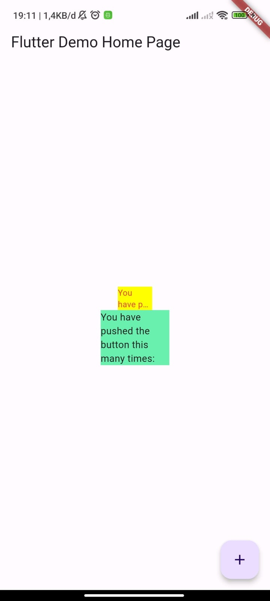

# **Laporan Praktikum**
# **Pertemuan 10**
### **Manajemen Plugin di Flutter**
------


### **Data Mahasiswa**


><p>Nama : Muhammad Endar Darmawan<p>
>Absen : 21<p>
>Kelas : TI - 3F<p>
>NIM : 2141720160<p>


<br>

### **Tujuan Praktikum**
Setelah menyelesaikan codelab ini Anda akan mampu untuk:

1. menjelaskan manfaat plugin
2. memasang plugin ke dalam project flutter
3. memanfaatkan plugin dalam aplikasi


<br>

---------
<br>

### **Praktikum Menerapkan Plugin di Project Flutter**
Selesaikan langkah-langkah praktikum berikut ini menggunakan editor Visual Studio Code (VS Code) atau Android Studio atau code editor lain kesukaan Anda.

### **Langkah 1 Siapkan project baru**
Buatlah sebuah project flutter baru dengan nama flutter_plugin_pubdev. Lalu jadikan repository di GitHub Anda dengan nama flutter_plugin_pubdev.<p>

### **Langkah 2 Menambahkan Plugin**
Tambahkan plugin auto_size_text menggunakan perintah berikut di terminal

```dart
flutter pub add auto_size_text
```

Jika berhasil, maka akan tampil nama plugin beserta versinya di file pubspec.yaml pada bagian dependencies.

### **Langkah 3 Buat file red_text_widget.dart**
Buat file baru bernama red_text_widget.dart di dalam folder lib lalu isi kode seperti berikut.

```dart
import 'package:flutter/material.dart';

class RedTextWidget extends StatelessWidget {
  const RedTextWidget({Key? key}) : super(key: key);

  @override
  Widget build(BuildContext context) {
    return Container();
  }
}
```

### **Langkah 4 Tambah Widget AutoSizeText**
Masih di file red_text_widget.dart, untuk menggunakan plugin auto_size_text, ubahlah kode return Container() menjadi seperti berikut.

```dart
return AutoSizeText(
      text,
      style: const TextStyle(color: Colors.red, fontSize: 14),
      maxLines: 2,
      overflow: TextOverflow.ellipsis,
);
```

Setelah Anda menambahkan kode di atas, Anda akan mendapatkan info error. Mengapa demikian? Jelaskan dalam laporan praktikum Anda!

### **Langkah 5: Buat Variabel text dan parameter di constructor**
Tambahkan variabel text dan parameter di constructor seperti berikut.

```dart
final String text;

const RedTextWidget({Key? key, required this.text}) : super(key: key);
```

### **Langkah 6: Tambahkan widget di main.dart**
Buka file main.dart lalu tambahkan di dalam children: pada class _MyHomePageState

```dart
Container(
   color: Colors.yellowAccent,
   width: 50,
   child: const RedTextWidget(
             text: 'You have pushed the button this many times:',
          ),
),
Container(
    color: Colors.greenAccent,
    width: 100,
    child: const Text(
           'You have pushed the button this many times:',
          ),
),
```
Run aplikasi tersebut dengan tekan F5, maka hasilnya akan seperti berikut.<p>

<br>

### **Tugas Praktikum**
1. Selesaikan Praktikum tersebut, lalu dokumentasikan dan push ke repository Anda berupa screenshot hasil pekerjaan beserta penjelasannya di file README.md!<p>

    >**Jawab**<p>
    >

2. Jelaskan maksud dari langkah 2 pada praktikum tersebut!<p>

    >**Jawab**
    >Perintah flutter pub add auto_size_text digunakan dalam Flutter untuk menambahkan package Flutter bernama auto_size_text ke dalam proyek Flutter kita. auto_size_text dapat membuat teks yang otomatis menyesuaikan ukuran berdasarkan ruang yang tersedia.

3. Jelaskan maksud dari langkah 5 pada praktikum tersebut!

    >**Jawab**
    >Final String text adalah deklarasi variabel untuk menyimpan teks yang akan ditampilkan dalam widget, sedangkan const RedTextWidget({Key? key, required this.text}) : super(key: key); adalah cara untuk membuat widget Flutter yang dapat menampilkan teks yang diberikan saat kita membuatnya. Saat kita menggunakan widget ini, maka akan memberikan nilai untuk text dan widget ini akan menampilkan teks tersebut sesuai dengan nilai yang  diberikan.


4. Pada langkah 6 terdapat dua widget yang ditambahkan, jelaskan fungsi dan perbedaannya!

    >**Jawab**
    >Terdapat 2 Widget pada Langkah 6, pada widget yang pertama menggunakan RedTextWidget, digunakan untuk menampilkan teks dengan warna merah. Sedangkan pada widget yang kedua, teks ditampilkan dengan menggunakan widget bawaan Text. RedTextWidget memiliki tampilan khusus yang disesuaikan, sementara Text hanya menampilkan teks dengan gaya default.

5. Jelaskan maksud dari tiap parameter yang ada di dalam plugin auto_size_text berdasarkan tautan pada dokumentasi ini !

|Parameter          |Penjelasan                
|-------------------|-------------------------------
|Key                |Diperuntukan untuk mengidentifikasi widget secara unik dalam widget tree. Ini berguna untuk mengontrol animasi, navigasi, fokus, dan lainnya
|textKey            |Diperuntukan untuk mengidentifikasi widget Text yang dibungkus oleh widget AutoSizeText. Ini berguna untuk mengakses properti atau metode dari widget Text
|style              |Diperuntukan untuk menentukan gaya teks seperti warna, ukuran, font, dll. Ini sama dengan parameter style pada widget Text
|minFontSize        |Diperuntukan untuk menentukan ukuran font terkecil yang diizinkan. Jika teks masih tidak muat, maka akan ditangani sesuai dengan parameter overflow.
|maxFontSize        |Diperuntukan untuk menentukan ukuran font terbesar yang diizinkan. Ini berguna jika gaya teks mewarisi ukuran font dan Anda ingin membatasinya.
|stepGranularity    |Diperuntukan untuk menentukan langkah penyesuaian ukuran font. Nilai ini menentukan seberapa halus perubahan ukuran font.
|presetFontSizes    |Diperuntukan untuk menentukan daftar ukuran font yang diizinkan. Jika parameter ini ditentukan, maka parameter minFontSize, maxFontSize, dan stepGranularity akan diabaikan. Widget AutoSizeText akan mencoba ukuran font dari daftar ini secara berurutan sampai teks muat dalam batasnya.
|group              |Diperuntukan untuk menyinkronkan ukuran font dari beberapa widget AutoSizeText. Mereka akan menyesuaikan batas mereka dan semua widget AutoSizeText dalam grup yang sama akan memiliki ukuran yang sama.

6. Kumpulkan laporan praktikum Anda berupa link repository GitHub ke spreadsheet yang telah disediakan!

    >

<br>
@EndarMuh