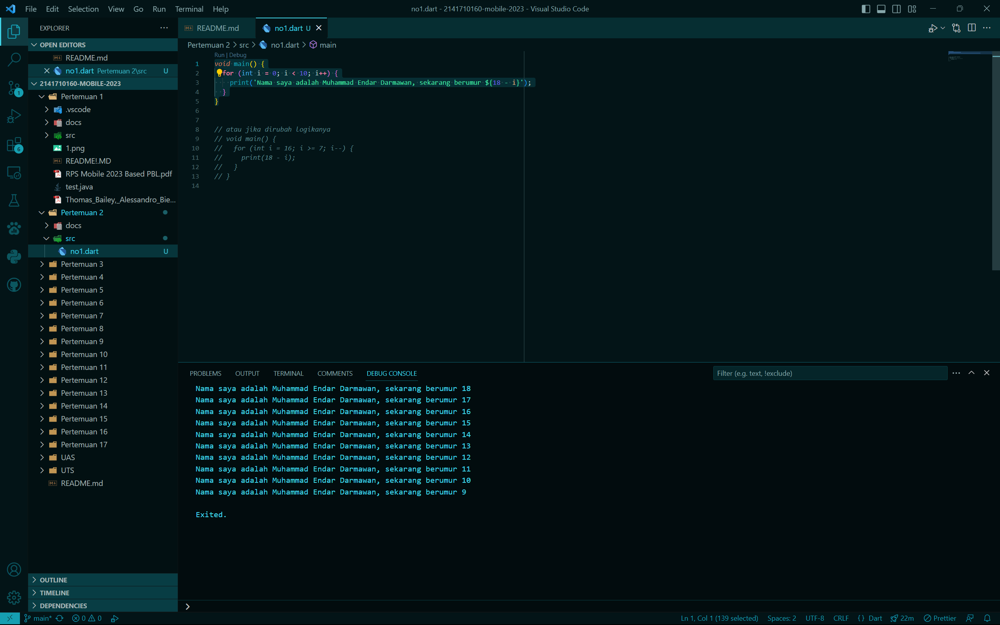

# WEEK 2

Muhammad Endar Darmawan

2141720160


# Soal 1
Modifikasilah kode pada baris 3 di VS Code atau Editor Code favorit Anda berikut ini agar mendapatkan keluaran (output) sesuai yang diminta!


```dart
void main() {
  for (int i = 0; i < 10; i++) {
    print('hello ${i + 2}');
  }
}
```

### Jawaban
```dart
void main() {
  for (int i = 0; i < 10; i++) {
    print('Nama saya adalah Muhammad Endar Darmawan, sekarang berumur ${18 - i}');
  }
}
```

## Output


# Soal 2
Mengapa sangat penting untuk memahami bahasa pemrograman Dart sebelum kita menggunakan framework Flutter ? Jelaskan!
### Jawaban
Sangat penting untuk memahami bahasa pemrograman dart karena flutter dibuat dan dibangun menggunakan bahasa dart serta sistem one single code. Ini merupakan alasan kuat kenapa kita harus belajar bahasa dart, dan tentu saja agar kita bisa menggunakan flutter dengan baik dan membangun aplikasi yang baik juga.

# Soal 3
Rangkumlah materi dari codelab ini menjadi poin-poin penting yang dapat Anda gunakan untuk membantu proses pengembangan aplikasi mobile menggunakan framework Flutter.
### Jawaban
Materi pada pertemuan hari ini mempelajari tentang : 
- Geeting started with Dart
- The evolution of Dart
- How Dart works
- Introducing the structure of the Dart language
- Hands-on with Dart

#### **Geeting started with Dart**
Bahasa pemrograman dart bertujuan untuk menggabungkan kelebihan dari bahasa tingkat tinggi seperti C, C++, Java, Python dll dengan fitur pemrograman terkini, contohnya :
- **Productive tooling**: merupakan fitur kakas (tool) untuk menganalisis kode, plugin IDE, dan ekosistem paket yang besar.
- **Garbage collection**: untuk mengelola atau menangani dealokasi memori (terutama memori yang ditempati oleh objek yang tidak lagi digunakan).
- **Type annotations (opsional)**: untuk keamanan dan konsistensi dalam mengontrol semua data dalam aplikasi.
- **Statically Typed**: Fitur ini penting untuk menemukan bug selama kompilasi kode.
- **Portability**: bahasa Dart tidak hanya untuk web (yang dapat diterjemahkan ke JavaScript) tetapi juga dapat dikompilasi secara native ke kode Advanced RISC Machines (ARM) dan x86.

Semua pengembangan framework Flutter melibatkan pengetahuan/fitur mendalam dengan bahasa Dart; Kode aplikasi, kode plugin, dan manajemen dependensi semuanya menggunakan bahasa Dart beserta fitur-fiturnya.

#### **The evolution of Dart**
Diluncurkan pada tahun 2011, Dart telah berkembang sejak saat itu. Dart merilis versi stabilnya pada tahun 2013, dengan perubahan besar termasuk dalam rilis Dart 2.0 menjelang akhir 2018, yang dapat diuraikan sebagai berikut :
- Awalnya berfokus pada pengembangan web, dengan tujuan utama menggantikan JavaScript, sekarang telah fokus pada mobile development, termasuk framework Flutter.
- **Mencoba memecahkan masalah pada JavaScript**
- **Menawarkan performa terbaik dan alat yang lebih baik untuk proyek berskala besar**
- **Dibentuk agar kuat dan fleksibel**

Dart merupakan bahasa moder yang mendukung lintas platform dan memiliki tujuan untuk meningkatkan fitur fiturnya yang membuatnya menjadi lebih kekinian dan fleksibel.

#### **How Dart works**
Cara mengeksekusi bahasa dart
- Dart **virtual machines (VMs)**
- JavaScript compilations

**Dart VM and JavaScript compilation**

Kode Dart dapat dieksekusi pada lingkungan yang mendukung bahasa Dart. Lingkungan yang mendukung bahasa Dart perlu memperhatikan fitur-fitur penting seperti berikut:

- Runtime systems
- Dart core libraries
- Garbage collectors

Eksekusi kode Dart dapat beroperasi dalam dua mode — kompilasi Just-In-Time (JIT) atau Kompilasi Ahead-Of-Time (AOT).

- Kompilasi JIT adalah tempat kode sumber dikompilasi sesuai kebutuhan—*Just in time*.
- Kompilasi AOT adalah dimana Dart VM dan kode yang dikompilasi sebelumnya

#### **Introducing the structure of the Dart language**
Dart menyediakan sebagian besar operator standar untuk memanipulasi variabel; *built-in types* adalah yang paling umum ditemukan dalam bahasa pemrograman tingkat tinggi. *Control flow* dan function sangat mirip dengan bahasa pemrograman lainnya. Seperti : 
- **Dart operators**
- **Arithmetic operators**
- **Increment and decrement operators**
- **Equality and relational operators**
- **Logical operators**

#### **Hands-on with Dart**
Desain Flutter sangat dipengaruhi oleh bahasa Dart, jadi kita mempelajari bahasa Dart itu sangat penting untuk keberhasilan dalam menggunakan framework Flutter. Mari kita mulai dengan menulis beberapa kode untuk memahami dasar-dasar sintaks dan kakas yang tersedia untuk pengembangan Dart.

**DartPad**
DartPad merupakan kakas online untuk mengeksplore fitur bahasa dart, tampilan nya mirip seperti IDE Visual Studio Code, anda bisa memulai dengan membuat kode hello world dll. Lalu ada juga **Main Functon**  yang memiliki kegunaan sama seperti bahasa pemrograman yang lain.