# WEEK 3

```sh
Muhammad Endar Darmawan
```
```sh
2141720160
```
<br>

# 2. Praktikum 1: Menerapkan Control Flows ("if/else")

## Langkah 1
Ketik atau salin kode program berikut ke dalam fungsi ```main().```

```dart
for (Index = 10; Index < 27; Index) {
    print(Index);
}
```

## Langkah 2
Silakan coba eksekusi (Run) kode pada langkah 1 tersebut. Apa yang terjadi? Jelaskan! Lalu perbaiki jika terjadi error.

### Hasil

Karena penulisan Else If seharusnya menggunakan huruf kecil semua (else if), jika menggunakan huruf kecil semua maka outputnya akan seperti dibawah.

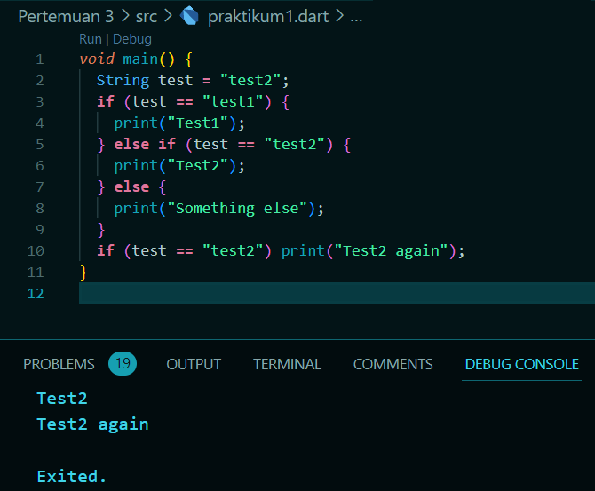

## Langkah 3
Tambahkan kode program berikut, lalu coba eksekusi (Run) kode Anda.
```dart
String test = "true";
if (test) {
    print("Kebenaran");
}
```
Apa yang terjadi ? Jika terjadi error, silakan perbaiki namun tetap menggunakan if/else.

### Hasil
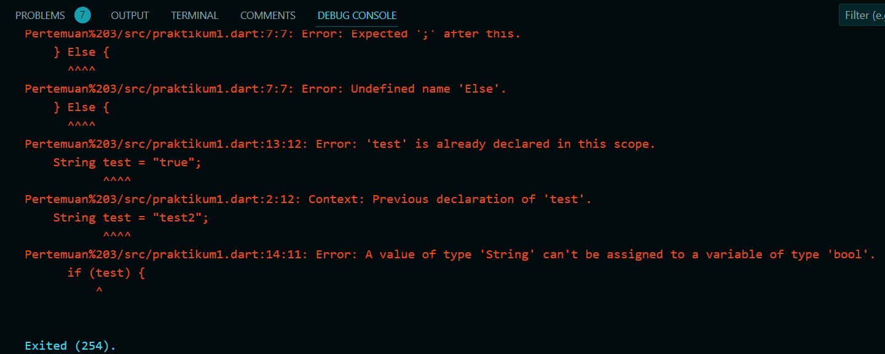
Karena variabel 'test' 2x dalam fungsi main() dan itu tidak diizinkan dart, setiap variabel harus memiliki nama yang berbeda.

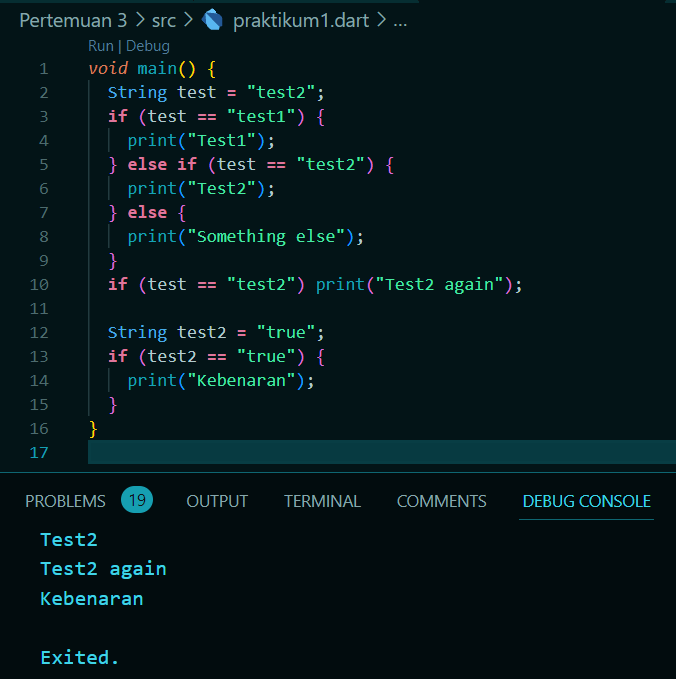

<br>

# 3. Praktikum 2: Menerapkan Perulangan "while" dan "do-while"

## Langkah 1
Ketik atau salin kode program berikut ke dalam fungsi ```main().```

```dart
while (counter < 33) {
    print(counter);
    counter++;
}
```

## Langkah 2
Silakan coba eksekusi (Run) kode pada langkah 1 tersebut. Apa yang terjadi? Jelaskan! Lalu perbaiki jika terjadi error.

### Hasil
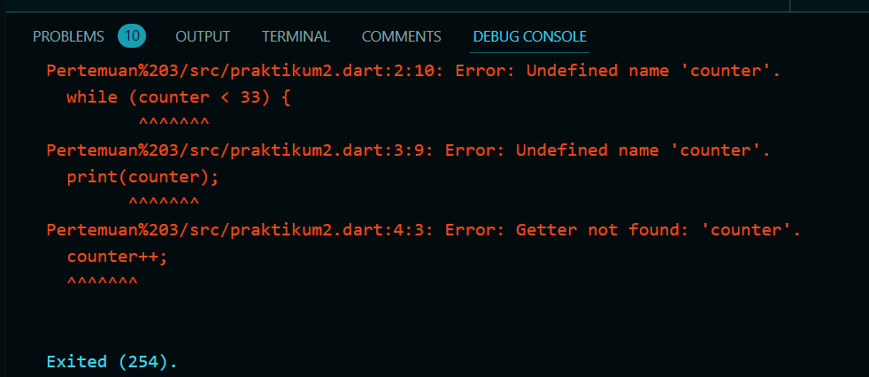
Karena variabel 'counter' belum dideklarasikan atau diinisiasikan sebelumnya. Jika sudah diinisialisasikan makan hasilnya akan seperti dibawah.

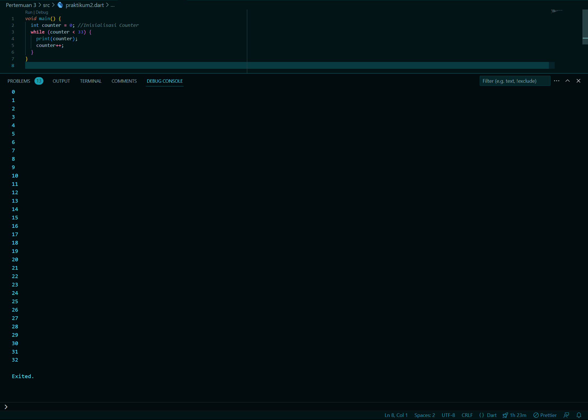

## Langkah 3
Tambahkan kode program berikut, lalu coba eksekusi (Run) kode Anda.

```dart
do {
    print(counter);
    counter+++;
} while (counter < 77);
```
Apa yang terjadi ? Jika terjadi error, silakan perbaiki namun tetap menggunakan do-while.

### Hasil
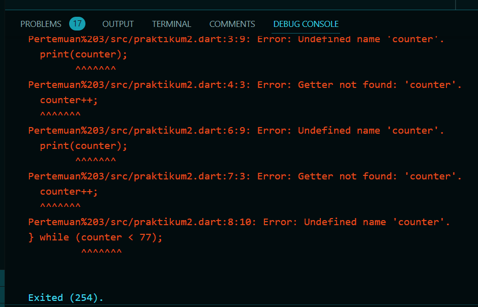
Karena variabel 'counter' belum dideklarasikan atau diinisiasikan sebelumnya. Jika sudah diinisialisasikan makan hasilnya akan seperti dibawah.

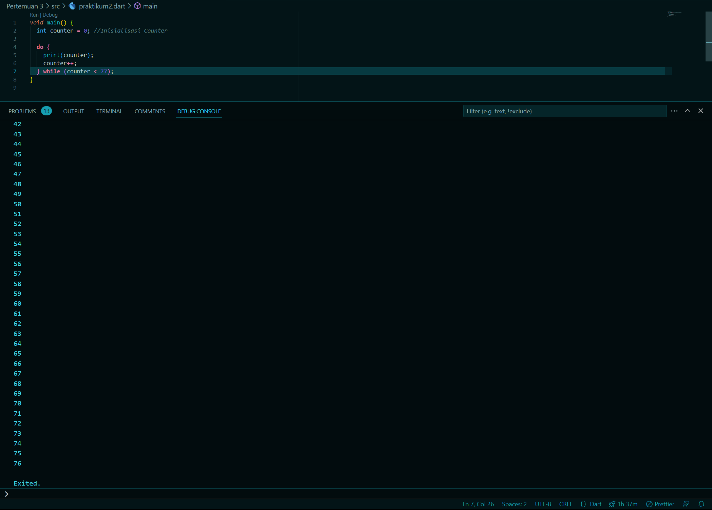

<br>

# 4. Praktikum 3: Menerapkan Perulangan "for" dan "break-continue"

## Langkah 1
Ketik atau salin kode program berikut ke dalam fungsi ```main().```

```dart
for (Index = 10; index < 27; index) {
    print(Index);
}
```

## Langkah 2
Silakan coba eksekusi (Run) kode pada langkah 1 tersebut. Apa yang terjadi? Jelaskan! Lalu perbaiki jika terjadi error.

### Hasil
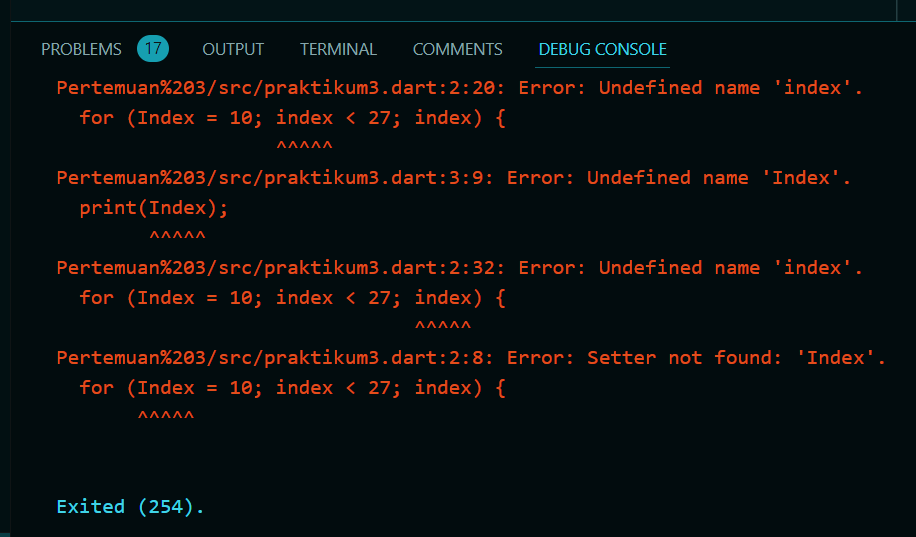
Karena deklarasi variabel index dengan tipe data int harus dimulai dengan huruf kecil (index bukan Index) mengikuti aturan konvensi penulisan bahasa pemrograman dart. Jika sudah dikoreksi maka hasilnya seperti dibawah.

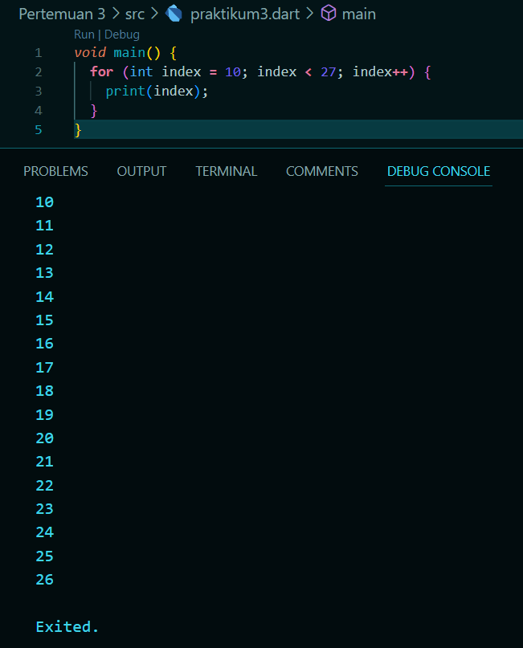

## Langkah 3
Tambahkan kode program berikut di dalam for-loop, lalu coba eksekusi (Run) kode Anda.
```dart
If (Index == 21) break;
Else If (index > 1 || index < 7) continue;
print(index);
```
Apa yang terjadi ? Jika terjadi error, silakan perbaiki namun tetap menggunakan for dan break-continue.

## Hasil
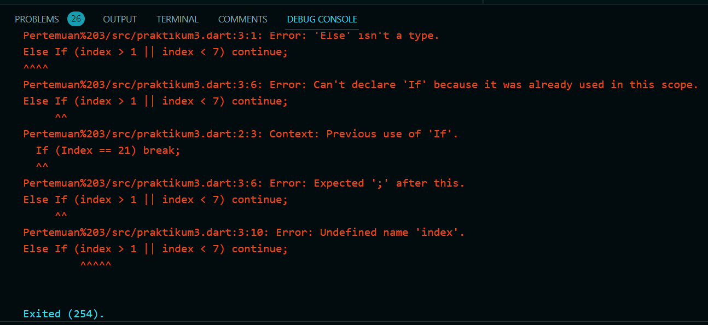
Sama seperti eror langkah sebelumnya, dikarenakan menggunakan Huruf kapital pada saat deklarasi variabel. Jika sudah dikoreksi maka hasilnya akan seperti dibawah.

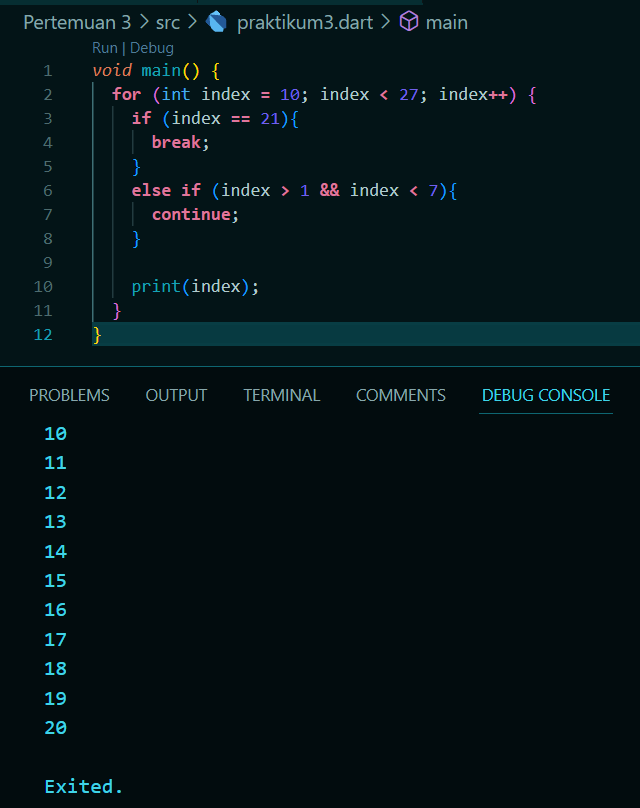

<br>

# 5. Tugas Praktikum
## Soal 1
Silakan selesaikan Praktikum 1 sampai 3, lalu dokumentasikan berupa screenshot hasil pekerjaan beserta penjelasannya!

### Jawaban
Sudah saya jawab diatas
- [Praktikum 1](#praktikum-1-menerapkan-control-flows-ifelse)
- [Praktikum 2](#praktikum-2-menerapkan-perulangan-while-dan-do-while)
- [Praktikum 3](#praktikum-3-menerapkan-perulangan-for-dan-break-continue)

## Soal 2
Buatlah sebuah program yang dapat menampilkan bilangan prima dari angka 0 sampai 201 menggunakan Dart. Ketika bilangan prima ditemukan, maka tampilkan nama lengkap dan NIM Anda.

### Jawaban
```dart
void main() {
  String primes = "";
  for (int number = 0; number <= 201; number++) {
    if (isPrime(number)) {
      primes += "$number ";
    }
  }
  print(primes);
  print("Nama : Muhammad Endar Darmawan");
  print("NIM  : 2141720160");
  print("");
}

bool isPrime(int number) {
  if (number < 2) {
    return false;
  }

  for (int i = 2; i <= number / 2; i++) {
    if (number % i == 0) {
      return false;
    }
  }

  return true;
}
```

## Output
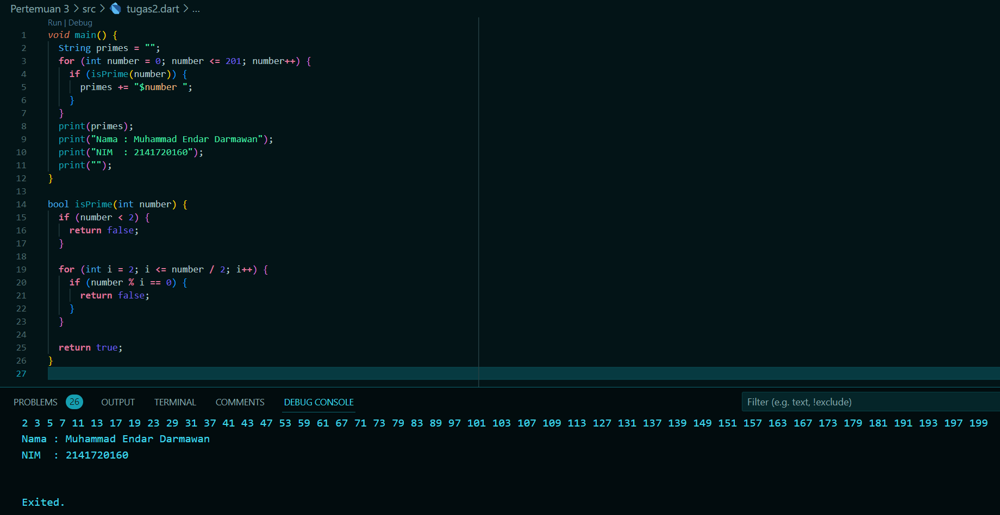

## Soal 3
Kumpulkan berupa link commit repo GitHub pada tautan yang telah disediakan di grup Telegram!

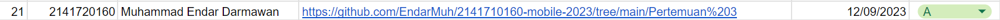