# WEEK 4

```sh
Muhammad Endar Darmawan
```
```sh
2141720160
```
<br>

# 2. Praktikum 1: Eksperimen Tipe Data List

## Langkah 1
Ketik atau salin kode program berikut ke dalam ``void main().``

```dart
    var list = [1, 2, 3];
    assert(list.length == 3);
    assert(list[1] == 2);
    print(list.length);
    print(list[1]);

    list[1] = 1;
    assert(list[1] == 1);
    print(list[1]);
```

## Langkah 2
Silakan coba eksekusi (Run) kode pada langkah 1 tersebut. Apa yang terjadi? Jelaskan!

### Hasil
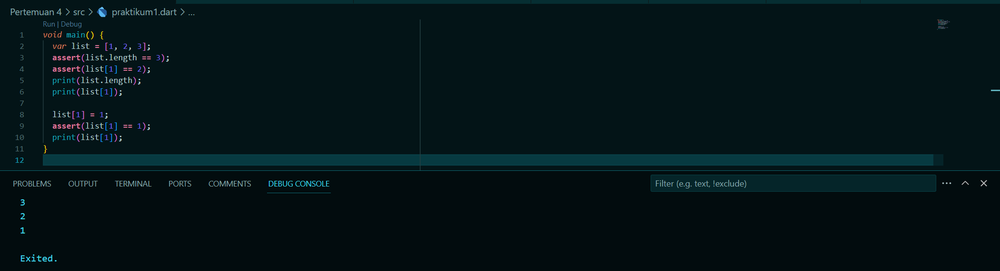

Kode diatas membuat list tiga angka, memeriksa dan mencetak panjang list serta nilai elemen kedua, mengubah elemen kedua dan kembali memeriksa serta mengecek nilai elemen kedua yang telah diubah.

## Langkah 3
Ubah kode pada langkah 1 menjadi variabel final yang mempunyai index = 5 dengan default value = null. Isilah nama dan NIM Anda pada elemen index ke-1 dan ke-2. Lalu print dan capture hasilnya.

Apa yang terjadi ? Jika terjadi error, silakan perbaiki.

### Hasil
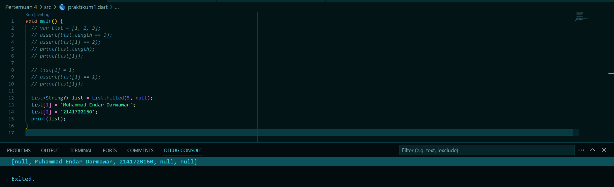

Kode diatas memiliki 5 kapasitas elemen, elemen pertama (0) diisi null, dan elemen kedua (1) dan ketiga (2) diisi dengan nama dan NIM.

<br>

# 3. Praktikum 2: Eksperimen Tipe Data Set

## Langkah 1
Ketik atau salin kode program berikut ke dalam ``void main().``

```dart
  var halogens = {'fluorine', 'chlorine', 'bromine', 'iodine', 'astatine'};
  print(halogens);
```

## Langkah 2
Silakan coba eksekusi (Run) kode pada langkah 1 tersebut. Apa yang terjadi? Jelaskan! Lalu perbaiki jika terjadi error.

### Hasil


Terdapat variabel yang diinialisasi dan set seperti pada potongan kode diatas, Set merupakan tipe data yang mengandung elemen yang unik dan tidak dapat di duplikat
## Langkah 3
Tambahkan kode program berikut, lalu coba eksekusi (Run) kode Anda.

```dart
    var names1 = <String>{};
    Set<String> names2 = {}; // This works, too.
    var names3 = {}; // Creates a map, not a set.

    print(names1);
    print(names2);
    print(names3);
```

Apa yang terjadi ? Jika terjadi error, silakan perbaiki namun tetap menggunakan ketiga variabel tersebut. Tambahkan elemen nama dan NIM Anda pada kedua variabel Set tersebut dengan dua fungsi berbeda yaitu ``.add()`` dan ``.addAll()``. Untuk variabel Map dihapus, nanti kita coba di praktikum selanjutnya.

### Hasil
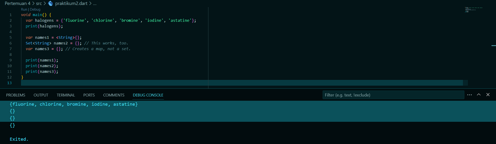

- Menambahkan Nama dan NIM.
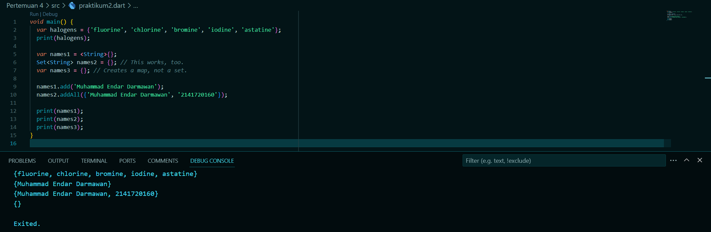

<br>

# 4. Praktikum 3: Eksperimen Tipe Data Maps

## Langkah 1
Ketik atau salin kode program berikut ke dalam ``void main().``

```dart
    var gifts = {
    // Key:    Value
    'first': 'partridge',
    'second': 'turtledoves',
    'fifth': 1
    };

    var nobleGases = {
    2: 'helium',
    10: 'neon',
    18: 2,
    };

    print(gifts);
    print(nobleGases);
```

## Langkah 2
Silakan coba eksekusi (Run) kode pada langkah 1 tersebut. Apa yang terjadi? Jelaskan! Lalu perbaiki jika terjadi error.

### Hasil
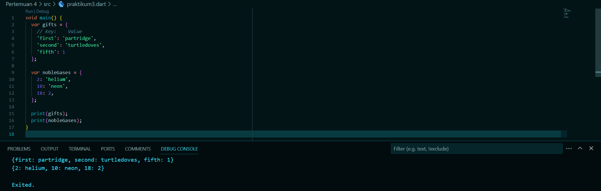

Kode diatas mengilustrasikan penggunaan tipe data map.

- Variabel gifts adalah sebuah map yang memiliki 3 pasangan key-value (partridge, turtledoves & fifth).

- Variabel nobleGases adalah map lain yang memiliki 2 pasangan key-value (helium & neon), dalam hal ini key dan value juga dapat berupa tipe data int dan string, menunjuka fleksibilitas tipe data dalam map dart.

## Langkah 3
Tambahkan kode program berikut, lalu coba eksekusi (Run) kode Anda.

```dart
    var mhs1 = Map<String, String>();
    gifts['first'] = 'partridge';
    gifts['second'] = 'turtledoves';
    gifts['fifth'] = 'golden rings';

    var mhs2 = Map<int, String>();
    nobleGases[2] = 'helium';
    nobleGases[10] = 'neon';
    nobleGases[18] = 'argon';
```

Apa yang terjadi ? Jika terjadi error, silakan perbaiki.

Tambahkan elemen nama dan NIM Anda pada tiap variabel di atas (gifts, nobleGases, mhs1, dan mhs2). Dokumentasikan hasilnya dan buat laporannya!

### Hasil
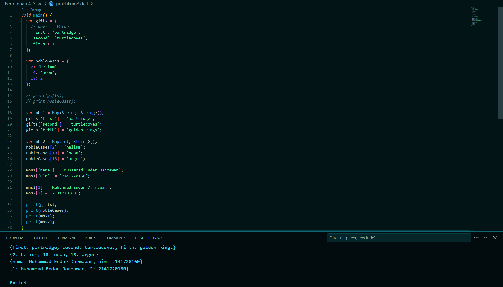

<br>

# 5. Praktikum 4: Eksperimen Tipe Data List: Spread dan Control-flow Operators

## Langkah 1
Ketik atau salin kode program berikut ke dalam fungsi ``main().``

```dart
    var list = [1, 2, 3];
    var list2 = [0, ...list];
    print(list1);
    print(list2);
    print(list2.length);
```

## Langkah 2
Silakan coba eksekusi (Run) kode pada langkah 1 tersebut. Apa yang terjadi? Jelaskan! Lalu perbaiki jika terjadi error.

### Hasil


Terjadi error dikarenakan nama variabel list yang digunakan di baris ke-3 seharusnya ``list1`` (tidak list), dan juga di baris ke-4 seharusnya ``var list2 = [0, ...list1];`` (bukan list)

- Setelah diperbaiki error nya
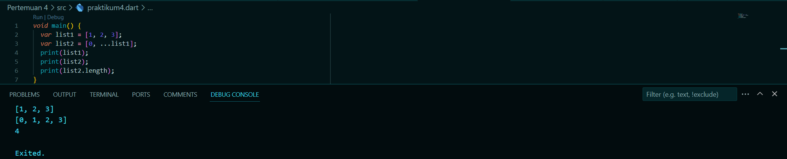

## Langkah 3
Tambahkan kode program berikut, lalu coba eksekusi (Run) kode Anda.

```dart
    list1 = [1, 2, null];
    print(list1);
    var list3 = [0, ...?list1];
    print(list3.length);
```

Apa yang terjadi ? Jika terjadi error, silakan perbaiki.

Tambahkan variabel list berisi NIM Anda menggunakan Spread Operators. Dokumentasikan hasilnya dan buat laporannya!

### Hasil
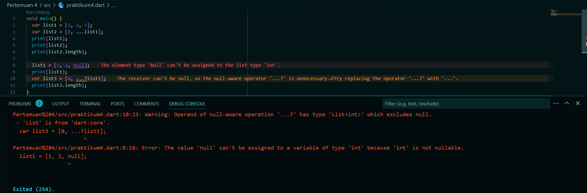

- Setelah diperbaiki errornya
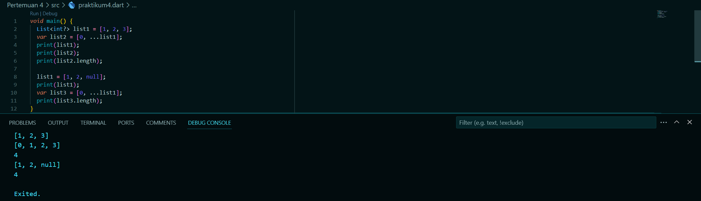

- Setelah ditambahkan NIM
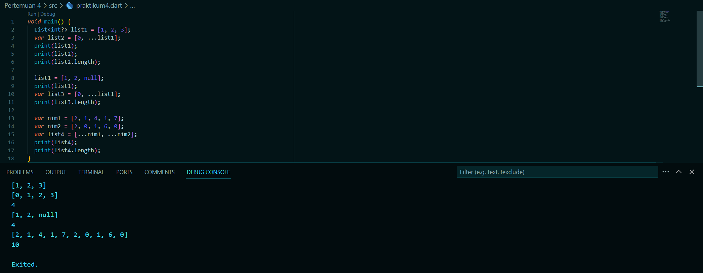

## Langkah 4
Tambahkan kode program berikut, lalu coba eksekusi (Run) kode Anda.

```dart
var nav = ['Home', 'Furniture', 'Plants', if (promoActive) 'Outlet'];
print(nav);
```

Apa yang terjadi ? Jika terjadi error, silakan perbaiki. Tunjukkan hasilnya jika variabel ``promoActive`` ketika ``true`` dan ``false``.

### Hasil
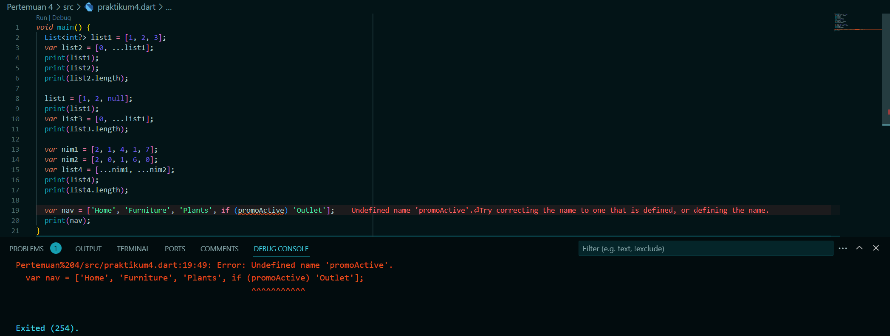

Terjadi error dikarenakan variable ``promoActive`` belum didefinisikan.

- Setelah diperbaiki error nya
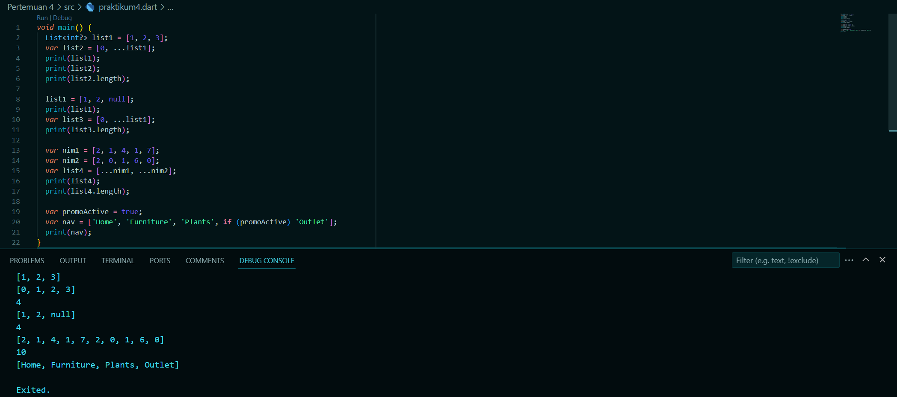

- ``promoActive`` bernilai ``true``


- ``promoActive`` bernilai ``false``
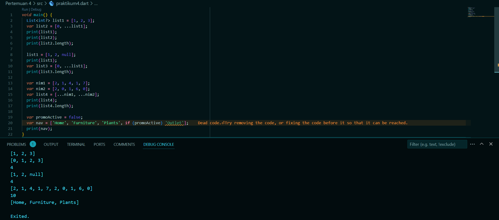

## Langkah 5
Tambahkan kode program berikut, lalu coba eksekusi (Run) kode Anda.

```dart
var nav2 = ['Home', 'Furniture', 'Plants', if (login case 'Manager') 'Inventory'];
print(nav2);
```

Apa yang terjadi ? Jika terjadi error, silakan perbaiki. Tunjukkan hasilnya jika variabel ``login`` mempunyai kondisi lain.

### Hasil
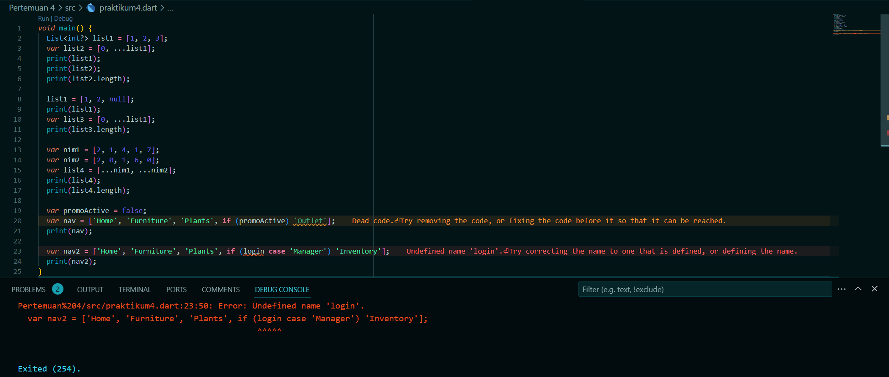

Terjadi error dikarenakan karena variable ``login`` belum didefinisikan.

- Setelah diperbaiki
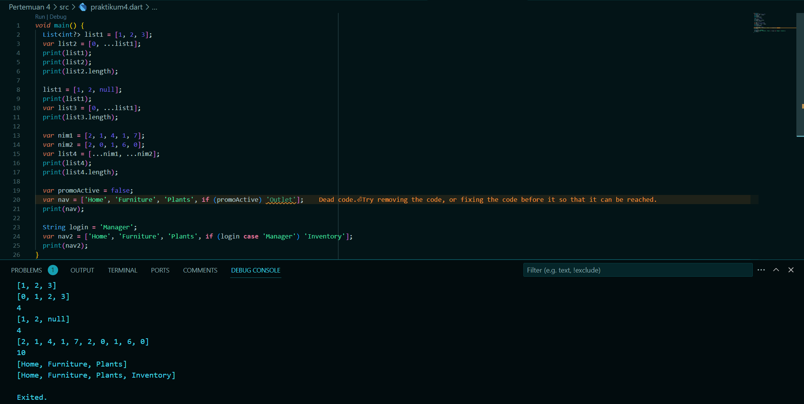

- Dijalankan dengan ``login = Seller;``
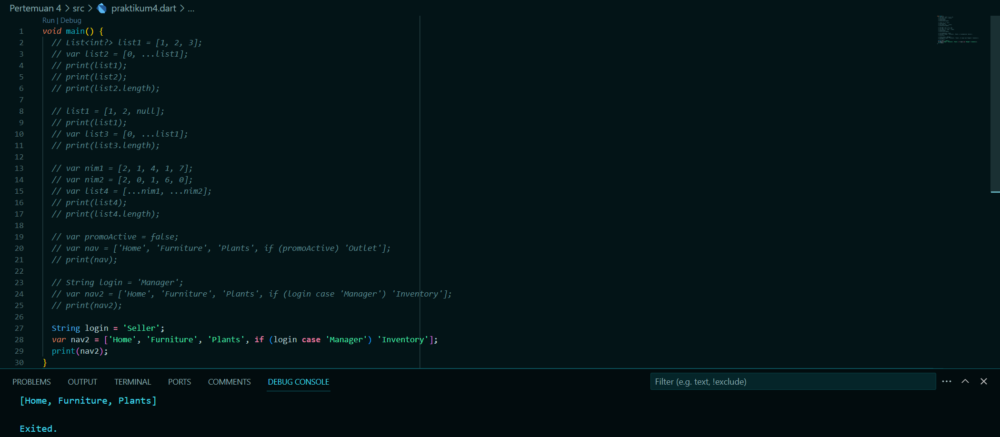

Inventory tidak muncul dikarenakan login sebagai seller bukan sebagai ``Manager``.

## Langkah 6

Tambahkan kode program berikut, lalu coba eksekusi (Run) kode Anda.

```dart
    var listOfInts = [1, 2, 3];
    var listOfStrings = ['#0', for (var i in listOfInts) '#$i'];
    assert(listOfStrings[1] == '#1');
    print(listOfStrings);
```

Apa yang terjadi ? Jika terjadi error, silakan perbaiki. Jelaskan manfaat Collection For dan dokumentasikan hasilnya.

### Hasil
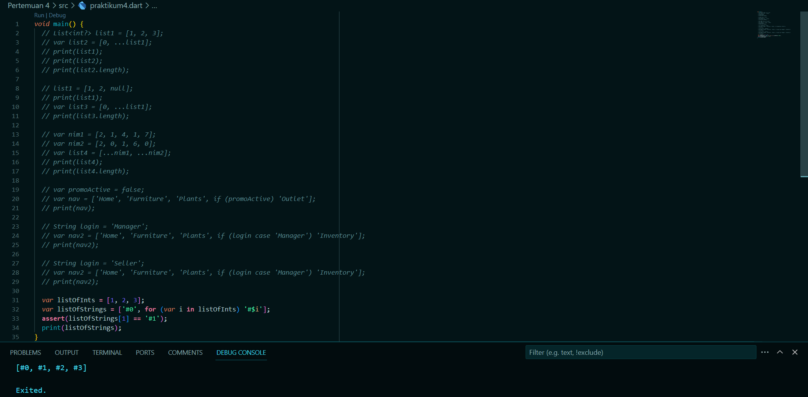

Pada kode diatas collection for digunakan untuk membuat daftar ``listOfStrings`` dengan mengulangi elemen-elemen dalam ``listOfInts`` dan menggabungkannya dengan tanda pagar (``#``).

<br>

# 6. Praktikum 5: Eksperimen Tipe Data Records

**Catatan:** Tipe data Records mulai diperkenalkan pada Dart versi 3.0. Pastikan Anda sudah setup menggunakan Dart 3.0 atau yang lebih baru.

## Langkah 1
Ketik atau salin kode program berikut ke dalam fungsi ``main()``.

```dart
    var record = ('first', a: 2, b: true, 'last');
    print(record)
```

## Langkah 2
Silakan coba eksekusi (Run) kode pada langkah 1 tersebut. Apa yang terjadi? Jelaskan! Lalu perbaiki jika terjadi error.

### Hasil
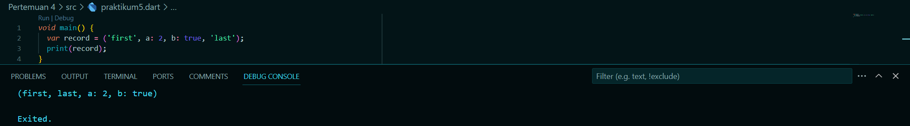

## Langkah 3
Tambahkan kode program berikut di luar scope ``void main()``, lalu coba eksekusi (Run) kode Anda.

```dart
    (int, int) tukar((int, int) record) {
    var (a, b) = record;
    return (b, a);
}
```

Apa yang terjadi ? Jika terjadi error, silakan perbaiki. Gunakan fungsi tukar() di dalam main() sehingga tampak jelas proses pertukaran value field di dalam Records.

### Hasil
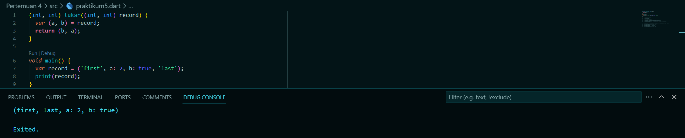

## Langkah 4
Tambahkan kode program berikut di dalam scope ``void main()``, lalu coba eksekusi (run) kode Anda.

```dart
    // Record type annotation in a variable declaration:
    (String, int) mahasiswa;
    print(mahasiswa);
```

Apa yang terjadi ? Jika terjadi error, silakan perbaiki. Inisialisasi field nama dan NIM Anda pada variabel record ``mahasiswa`` di atas. Dokumentasikan hasilnya dan buat laporannya!

### Hasil
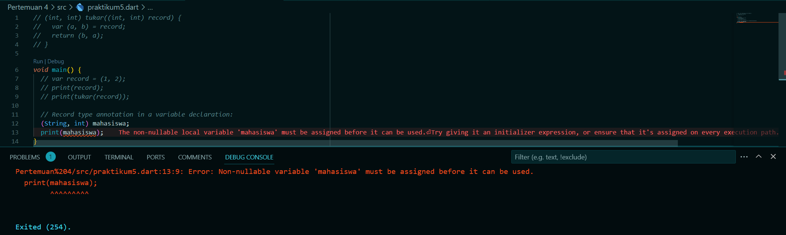

Terjadi error dikarenakan nama dan NIM belum diinialisasikan.

- Setelah diperbaiki dan field nama dan NIM diberi nilai.
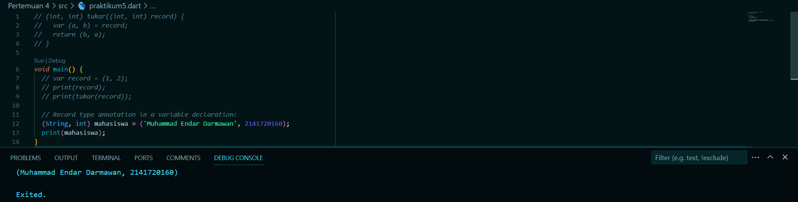

## Langkah 5
Tambahkan kode program berikut di dalam scope  ``void main()``, lalu coba eksekusi (Run) kode Anda.

```dart
    var mahasiswa2 = ('first', a: 2, b: true, 'last');

    print(mahasiswa2.$1); // Prints 'first'
    print(mahasiswa2.a); // Prints 2
    print(mahasiswa2.b); // Prints true
    print(mahasiswa2.$2); // Prints 'last'
```

Apa yang terjadi ? Jika terjadi error, silakan perbaiki. Gantilah salah satu isi record dengan nama dan NIM Anda, lalu dokumentasikan hasilnya dan buat laporannya!

### Hasil
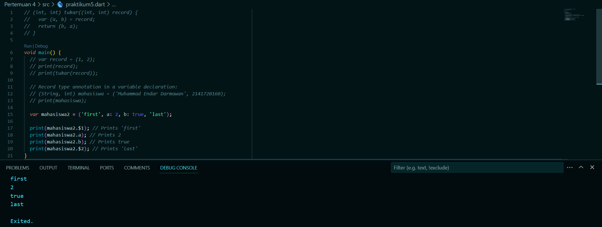

- Setelah ditambahkan Nama dan NIM pada salah satu record.
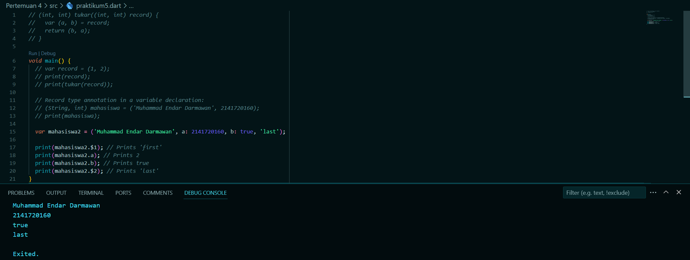

<br>

# 7. Tugas Praktikum
## Soal 1
Silakan selesaikan Praktikum 1 sampai 5, lalu dokumentasikan berupa screenshot hasil pekerjaan Anda beserta penjelasannya!

### Jawaban
Sudah saya kerjakan bisa dicek diatas laporan ini.

## Soal 2
Jelaskan yang dimaksud Functions dalam bahasa Dart!

### Jawaban
Function atau fungsi adalah blok bangunan dari kode yang dapat dibaca, dipelihara, dan dapat digunakan kembali. Fungsi adalah sekumpulan pernyataan untuk melakukan tugas tertentu.

Fungsi mengatur program ke dalam blok kode logis. Setelah didefinisikan, fungsi dapat dipanggil untuk mengakses kode.

Hal ini membuat kode dapat digunakan kembali. Selain itu, fungsi memudahkan untuk membaca dan memelihara kode program. Deklarasi fungsi memberi tahu kompiler tentang nama fungsi, tipe pengembalian, dan parameter.

## Soal 3
Jelaskan jenis-jenis parameter di Functions beserta contoh sintaksnya!

### Jawaban
- Positional Parameter:

Contoh sintaks:
```dart
int tambah(int a, int b) {
  return a + b;
}
```

Pada contoh di atas, a dan b adalah positional parameter. Saat fungsi tambah dipanggil, kita harus memberikan dua nilai yang akan digunakan sebagai nilai a dan b.

- Named Parameter:

Contoh sintaks:
```dart
void printInfo({String name, int age}) {
  print("Name: $name");
  print("Age: $age");
}
```

Pada contoh di atas, name dan age adalah named parameter. Kita dapat memanggil fungsi printInfo dengan menyebutkan nama parameter dan nilainya secara eksplisit, seperti printInfo(name: "John", age: 25).

- Default Parameter:

Contoh sintaks:
```dart
int pangkat(int x, {int n = 2}) {
  return x.pow(n);
}
```

Pada contoh di atas, n adalah default parameter. Jika kita tidak memberikan nilai untuk parameter n saat memanggil fungsi pangkat, maka nilai defaultnya akan digunakan.

- Required Parameter:

Contoh sintaks:
```dart
void printInfo(String name, int age) {
  print("Name: $name");
  print("Age: $age");
}
```

Pada contoh di atas, name dan age adalah required parameter. Saat memanggil fungsi printInfo, kita harus memberikan dua nilai yang akan digunakan sebagai nilai name dan age.

## Soal 4
Jelaskan maksud Functions sebagai first-class objects beserta contoh sintaknya!

### Jawaban
Dalam Dart, Functions adalah first-class objects, yang berarti mereka dapat diperlakukan seperti objek lainnya. Beberapa contoh sifat first-class objects pada Functions di Dart adalah:

- Functions dapat disimpan dalam variabel:

```dart
int tambah(int a, int b) {
  return a + b;
}

var fungsiPenjumlahan = tambah;
print(fungsiPenjumlahan(2, 3)); // Output: 5
```

- Functions dapat dijadikan sebagai parameter untuk fungsi lain:

```dart
void operasiMatematika(int a, int b, Function fungsi) {
  print(fungsi(a, b));
}

int tambah(int a, int b) {
  return a + b;
}

operasiMatematika(2, 3, tambah); // Output: 5
```

- Functions dapat dikembalikan sebagai nilai dari fungsi lain:

```dart
Function operasiMatematika(String operator) {
  if (operator == '+') {
    return (int a, int b) => a + b;
  } else if (operator == '-') {
    return (int a, int b) => a - b;
  } else {
    return null;
  }
}

var fungsiPenjumlahan = operasiMatematika('+');
print(fungsiPenjumlahan(2, 3)); // Output: 5
```

Dengan sifat first-class objects ini, Functions dapat digunakan secara fleksibel dalam pemrograman Dart, seperti disimpan dalam variabel, dikirim sebagai parameter, atau dikembalikan sebagai nilai.

## Soal 5
Apa itu Anonymous Functions? Jelaskan dan berikan contohnya!

### Jawaban
Anonymous Functions, juga dikenal sebagai lambda functions atau function literals, adalah fungsi yang tidak memiliki nama. Mereka digunakan ketika kita hanya perlu mendefinisikan dan menggunakan fungsi secara sederhana, tanpa perlu memberikannya nama yang unik.

Contoh sintaks Anonymous Functions dalam Dart:
```dart
void main() {
  // Contoh 1: Anonymous Function tanpa parameter
  var hello = () {
    print('Hello, World!');
  };
  hello(); // Output: Hello, World!

  // Contoh 2: Anonymous Function dengan parameter
  var sum = (int a, int b) {
    return a + b;
  };
  print(sum(2, 3)); // Output: 5

  // Contoh 3: Anonymous Function sebagai parameter
  void performOperation(int a, int b, Function operation) {
    print(operation(a, b));
  }

  performOperation(4, 2, (a, b) => a * b); // Output: 8
}
```

Dalam contoh di atas:
- Contoh 1: Sebuah Anonymous Function tanpa parameter digunakan untuk mencetak "Hello, World!".
- Contoh 2: Sebuah Anonymous Function dengan parameter `a` dan `b` digunakan untuk menjumlahkan dua bilangan.
- Contoh 3: Sebuah Anonymous Function digunakan sebagai parameter untuk fungsi `performOperation` yang akan mengalikan dua bilangan.

## Soal 6
Jelaskan perbedaan Lexical scope dan Lexical closures! Berikan contohnya!

### Jawaban
Lexical scope adalah aturan penentuan aksesibilitas variabel berdasarkan posisi fisiknya dalam kode. Dalam lexical scope, sebuah variabel dapat diakses di dalam blok kode tempat variabel tersebut dideklarasikan dan di dalam blok kode yang bersarang di dalamnya.

Contoh Lexical Scope:
```dart
void main() {
  var x = 10;

  void printX() {
    print(x);
  }

  printX(); // Output: 10
}
```
Pada contoh di atas, variabel `x` dideklarasikan di dalam fungsi `main`. Variabel `x` dapat diakses di dalam fungsi `printX` karena `printX` berada di dalam lexical scope dari `x`.

Lexical closure adalah kombinasi antara fungsi dan lingkungan lexical scope di mana fungsi tersebut didefinisikan. Dalam lexical closure, fungsi dapat mengakses dan mereferensikan variabel yang berada di lingkungan lexical scope di mana fungsi tersebut didefinisikan, meskipun lingkungan lexical scope tersebut sudah tidak aktif.

Contoh Lexical Closure:
```dart
Function adder(int x) {
  return (int y) => x + y;
}

void main() {
  var add5 = adder(5);
  print(add5(3)); // Output: 8
}
```
Pada contoh di atas, fungsi `adder` mengembalikan fungsi lain yang menambahkan nilai parameter `x` dengan nilai parameter `y`. Ketika kita memanggil `adder(5)`, kita mendapatkan sebuah fungsi yang memiliki akses ke variabel `x` dengan nilai 5. Kemudian, saat kita memanggil `add5(3)`, fungsi tersebut menambahkan 5 dengan 3 dan mengembalikan hasilnya, yaitu 8. Meskipun lingkungan lexical scope dari `x` (yaitu fungsi `adder`) sudah tidak aktif, fungsi yang dikembalikan oleh `adder` masih dapat mengakses variabel `x` karena memiliki lexical closure dengan lingkungan lexical scope tersebut.

## Soal 7
Jelaskan dengan contoh cara membuat return multiple value di Functions!

### Jawaban
Di Dart, sebuah fungsi hanya dapat mengembalikan satu nilai. Namun, kita dapat menggunakan objek seperti `List` atau `Map` untuk mengembalikan multiple value dari sebuah fungsi. Berikut adalah contoh cara membuat return multiple value di Dart menggunakan `List`:

```dart
List<int> getMinMax(List<int> numbers) {
  int min = numbers[0];
  int max = numbers[0];

  for (int number in numbers) {
    if (number < min) {
      min = number;
    }
    if (number > max) {
      max = number;
    }
  }

  return [min, max];
}

void main() {
  List<int> numbers = [5, 2, 9, 1, 7];
  List<int> result = getMinMax(numbers);

  int min = result[0];
  int max = result[1];

  print('Min: $min'); // Output: Min: 1
  print('Max: $max'); // Output: Max: 9
}
```

Pada contoh di atas, fungsi `getMinMax` menerima sebuah list of integers dan mengembalikan list yang berisi nilai minimum dan maksimum dari list tersebut. Di dalam fungsi, kita menggunakan variabel `min` dan `max` untuk melacak nilai minimum dan maksimum. Setelah selesai melalui list, kita mengembalikan list `[min, max]`.

Di dalam fungsi `main`, kita memanggil `getMinMax` dengan list `numbers` dan menyimpan hasilnya di variabel `result`. Kita dapat mengakses nilai minimum dan maksimum dari `result` dengan menggunakan indeks `0` dan `1` pada list.

Alternatif lain adalah menggunakan `Map` untuk mengembalikan multiple value. Berikut adalah contohnya:

```dart
Map<String, int> getMinMax(List<int> numbers) {
  int min = numbers[0];
  int max = numbers[0];

  for (int number in numbers) {
    if (number < min) {
      min = number;
    }
    if (number > max) {
      max = number;
    }
  }

  return {'min': min, 'max': max};
}

void main() {
  List<int> numbers = [5, 2, 9, 1, 7];
  Map<String, int> result = getMinMax(numbers);

  int min = result['min'];
  int max = result['max'];

  print('Min: $min'); // Output: Min: 1
  print('Max: $max'); // Output: Max: 9
}
```

Pada contoh ini, kita mengembalikan `Map` yang memiliki dua pasangan key-value, yaitu 'min' dan 'max'. Kita dapat mengakses nilai minimum dan maksimum dengan menggunakan key tersebut pada `result`.

## Soal 8
Kumpulkan berupa link commit repo GitHub pada tautan yang telah disediakan di grup Telegram!

### Jawaban


@EndarMuh 

@copyright2023